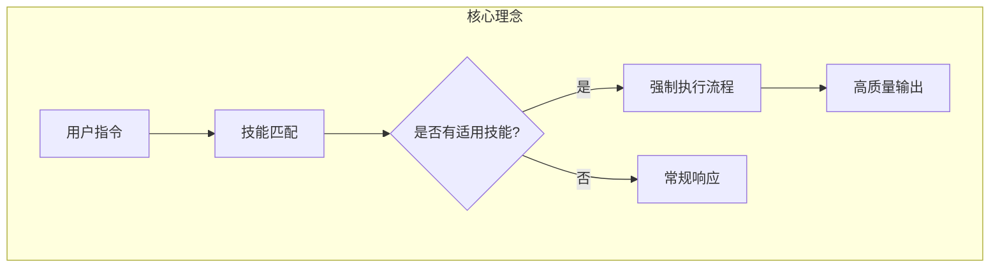
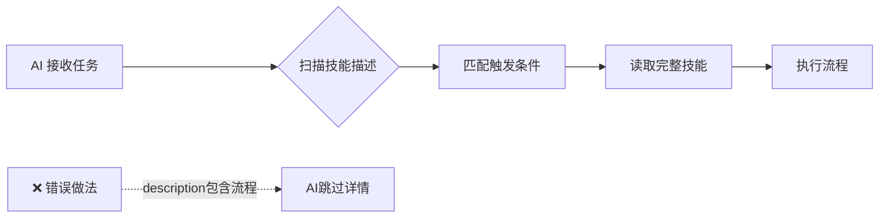
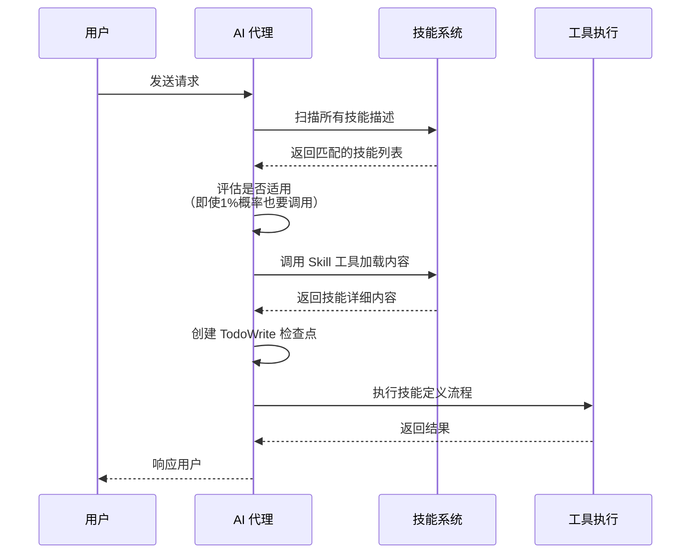
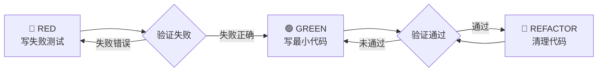
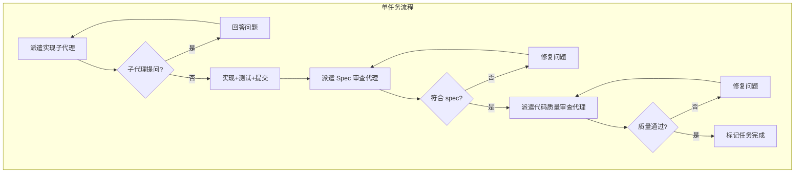
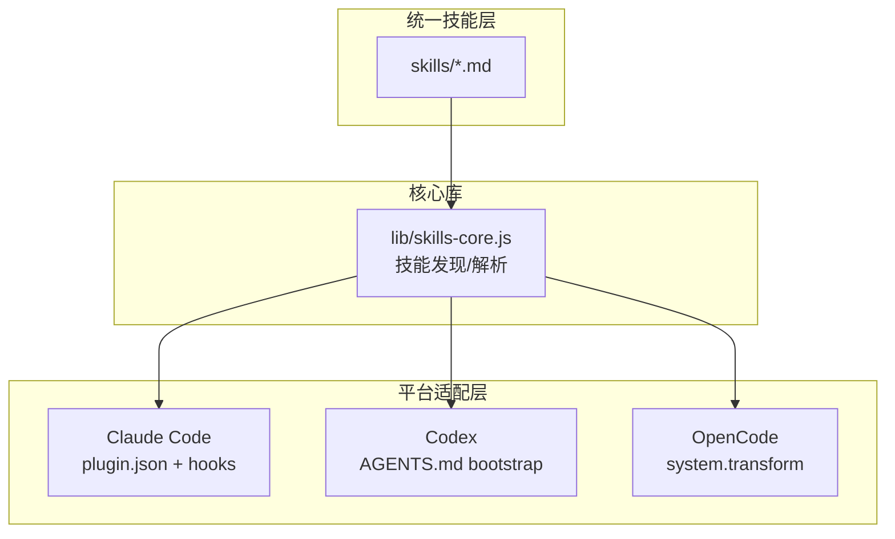

# Superpowers 研究报告

## 要点速览

| 维度 | 说明 |
|------|------|
| **定位** | AI 编码代理的完整软件开发工作流框架 |
| **核心思想** | 将 TDD（测试驱动开发）从代码层面提升到流程层面 |
| **设计哲学** | Systematic over ad-hoc（系统化优于临时性） |
| **技能数量** | 14 个核心技能，覆盖测试、调试、协作、代码审查等 |
| **多平台支持** | Claude Code（插件）、Codex（AGENTS.md）、OpenCode（插件） |

---

## 一、整体概览

### 1.1 项目定位

Superpowers 是一个**面向 AI 编码代理的技能框架**，它把软件开发的最佳实践（TDD、系统调试、代码审查等）封装成可复用的"技能"（Skills）。这些技能不是简单的提示词模板，而是**强制性的工作流程**——只要条件匹配，AI 代理必须遵循。



### 1.2 设计哲学

| 原则 | 解释 |
|------|------|
| **Test-Driven Development** | 先写测试，再写代码，无一例外 |
| **Systematic over ad-hoc** | 流程优于随机应变，拒绝"即兴发挥" |
| **Complexity reduction** | 以简化作为首要目标 |
| **Evidence over claims** | 验证通过才算完成，不凭感觉 |

---

## 二、目录结构

```
vendors/superpowers/
├── .claude-plugin/          # Claude Code 插件配置
│   ├── plugin.json          # 插件清单（版本 4.1.1）
│   └── marketplace.json     # 应用市场注册
├── .codex/                  # Codex CLI 配置和安装脚本
├── .opencode/               # OpenCode 插件
├── agents/                  # 子代理定义
│   └── code-reviewer.md     # 代码审查子代理
├── commands/                # Slash 命令
│   ├── brainstorm.md        # /superpowers:brainstorm
│   ├── write-plan.md        # /superpowers:write-plan
│   └── execute-plan.md      # /superpowers:execute-plan
├── docs/                    # 文档
├── hooks/                   # 生命周期钩子
│   ├── hooks.json           # 钩子定义
│   └── session-start.sh     # 会话启动时注入技能
├── lib/                     # 核心 JavaScript 库
│   └── skills-core.js       # 技能发现、解析、加载
├── skills/                  # 核心技能库（14个）
│   ├── using-superpowers/   # 引导技能（每次会话自动加载）
│   ├── test-driven-development/
│   ├── systematic-debugging/
│   ├── brainstorming/
│   ├── writing-plans/
│   ├── executing-plans/
│   ├── subagent-driven-development/
│   ├── dispatching-parallel-agents/
│   ├── requesting-code-review/
│   ├── receiving-code-review/
│   ├── using-git-worktrees/
│   ├── finishing-a-development-branch/
│   ├── writing-skills/      # 元技能：如何写技能
│   └── verification-before-completion/
└── tests/                   # 测试套件
```

---

## 三、核心模块职责

| 模块 | 职责 | 关键文件 | 扩展点 |
|------|------|----------|--------|
| **技能引擎** | 发现、解析、加载技能 | `lib/skills-core.js` | 支持个人技能覆盖 |
| **引导系统** | 会话启动时注入基础技能 | `hooks/session-start.sh` | 可自定义钩子 |
| **Slash 命令** | 提供交互式命令入口 | `commands/*.md` | 可添加新命令 |
| **子代理** | 执行特定任务的专用代理 | `agents/*.md` | 可定义新代理类型 |
| **技能库** | 14个核心技能文档 | `skills/*/SKILL.md` | 可贡献新技能 |

---

## 四、关键机制详解

### 4.1 技能格式与发现

技能采用**标准化 Markdown 格式**，包含 YAML Frontmatter：

```yaml
---
name: skill-name
description: Use when [触发条件] - [具体场景]
---
```

**关键设计：description 只描述触发条件，不描述流程**

这是 Superpowers 的一个重要洞察：如果 description 描述了流程，AI 可能会直接按 description 执行，而不去读取完整的技能文档。这会导致流程执行不完整。



### 4.2 技能调用机制



### 4.3 核心规则：1% 原则

Superpowers 的核心规则：**只要任务有 1% 的概率适用某个技能，就必须调用它**。

这个设计是为了对抗 AI 的"理性化"倾向——AI 往往会因为"看起来简单"、"我记得这个技能"、"先探索一下"等原因跳过流程。1% 原则消除了这种主观判断空间。

| 常见借口 | 现实 |
|----------|------|
| "这只是个简单问题" | 问题也是任务，需要检查技能 |
| "我需要先获取上下文" | 技能检查**优先于**澄清问题 |
| "我记得这个技能" | 技能会演进，必须读取当前版本 |
| "这不需要正式技能" | 如果技能存在，就必须使用 |

### 4.4 技能类型

| 类型               | 特点          | 示例       |
| ---------------- | ----------- | -------- |
| **Rigid（严格）**    | 必须严格遵循，不许变通 | TDD、调试流程 |
| **Flexible（灵活）** | 可根据上下文调整原则  | 设计模式     |

---

## 五、典型技能详解

### 5.1 Test-Driven Development（测试驱动开发）

这是 Superpowers 的**核心技能**，体现了整个框架的设计哲学。

**RED-GREEN-REFACTOR 循环：**



**铁律：**
```
NO PRODUCTION CODE WITHOUT A FAILING TEST FIRST
（没有失败的测试，就不写生产代码）
```

如果先写了代码？**删掉，重新开始**。没有例外。

### 5.2 Subagent-Driven Development（子代理驱动开发）

这是 Superpowers 的**高级工作流**，用于执行复杂计划。

**核心设计：**
- 每个任务启动一个**全新的子代理**（避免上下文污染）
- **两阶段审查**：先审查是否符合 spec，再审查代码质量
- 审查发现问题 → 原实现代理修复 → 重新审查



### 5.3 Writing Skills（编写技能）

这是一个**元技能**——教 AI 如何编写新的技能。

**核心洞察：** 编写技能 = 将 TDD 应用于流程文档

| TDD 概念 | 技能编写对应 |
|----------|--------------|
| 测试用例 | 压力场景（用子代理测试） |
| 生产代码 | 技能文档（SKILL.md） |
| 测试失败 | 代理违反规则 |
| 测试通过 | 代理遵循规则 |
| 重构 | 关闭漏洞 |

**铁律同样适用：**
```
NO SKILL WITHOUT A FAILING TEST FIRST
（没有失败的测试，就不写技能）
```

---

## 六、多平台适配架构

Superpowers 支持三个 AI 编码平台，采用**统一技能格式 + 平台特定引导机制**：



| 平台 | 引导机制 | 技能加载方式 |
|------|----------|--------------|
| Claude Code | Plugin + session-start hook | Skill 工具 |
| Codex | AGENTS.md + bootstrap 脚本 | 文件系统 |
| OpenCode | experimental.chat.system.transform | 文件系统 |

---

## 七、核心设计取舍

### 7.1 为什么用 Markdown + YAML 而不是代码？

| 方案 | 优点 | 缺点 |
|------|------|------|
| **Markdown + YAML**（Superpowers 选择） | 可读性强、版本控制友好、易于贡献 | 解析开销、无类型检查 |
| **JSON/代码** | 结构化、可验证 | 对非开发者不友好、难以快速编辑 |

**取舍理由：** 技能的主要读者是 AI，但主要编写者是人类。Markdown 在可读性和结构化之间取得了平衡。

### 7.2 为什么强制技能调用而不是建议？

| 方案 | 结果 |
|------|------|
| **建议式** | AI 会在压力下理性化跳过流程 |
| **强制式**（Superpowers 选择） | 消除主观判断空间，确保一致性 |

**取舍理由：** AI 和人类一样，在时间压力、任务复杂度面前会寻找捷径。强制性规则是质量的保险。

### 7.3 为什么每个任务用新子代理？

| 方案                         | 优点              | 缺点                |
| -------------------------- | --------------- | ----------------- |
| **单代理持续**                  | 上下文连续、省 token   | 上下文污染、错误累积        |
| **每任务新代理**（Superpowers 选择） | 干净上下文、并行安全、质量隔离 | token 消耗增加、需要更多协调 |

**取舍理由：** 质量 > 成本。子代理成本远低于调试错误代码的成本。

---

## 八、落地建议

### 8.1 适用场景

✅ **推荐使用：**
- 需要高质量、可维护代码的项目
- 团队协作，需要一致的编码规范
- 复杂功能开发，需要系统化规划
- 调试困难问题，需要结构化排查

❌ **不太适合：**
- 一次性原型验证（快速试错比质量重要）
- 完全探索性任务（目标不明确）
- 已有成熟流程且运行良好的团队

### 8.2 渐进式采用


建议从 **TDD 技能**开始，因为这是最基础也最有价值的改变。

### 8.3 自定义技能

可以创建个人技能覆盖默认行为：

```
~/.claude/skills/my-skill/SKILL.md  # 个人技能
vendors/superpowers/skills/...       # 系统技能
```

**命名空间机制：** `superpowers:skill-name` 强制使用系统技能，`skill-name` 优先匹配个人技能。

### 8.4 开发团队集成建议

| 场景 | 建议 |
|------|------|
| 代码审查 | 使用 `requesting-code-review` 技能作为审查清单 |
| 新人入职 | 让新人按 Superpowers 流程工作，快速学习最佳实践 |
| 技术债务清理 | 使用 TDD 技能为遗留代码补测试 |
| 故障排查 | 使用 `systematic-debugging` 建立排查 SOP |

---

## 九、总结

Superpowers 是一个**把软件工程最佳实践编码为 AI 工作流**的框架。它的核心价值在于：

1. **消除理性化空间** —— 通过强制性规则确保 AI 始终遵循最佳实践
2. **TDD 无处不在** —— 从代码到文档，全部遵循 RED-GREEN-REFACTOR
3. **子代理分工** —— 通过任务隔离和两阶段审查确保质量
4. **平台无关** —— 统一技能格式，支持多种 AI 编码工具

### 关键启示

> "如果你没看到测试失败，你就不知道它在测试什么。"

这个原则不仅适用于代码，也适用于流程、文档、甚至这份报告本身。

---

## 参考资源

- 官方仓库：https://github.com/obra/superpowers
- Claude Code 插件市场：`obra/superpowers-marketplace`
- 原始文档：`vendors/superpowers/README.md`

---

*报告生成时间：2026-01-28*
*基于 Superpowers v4.1.1*
