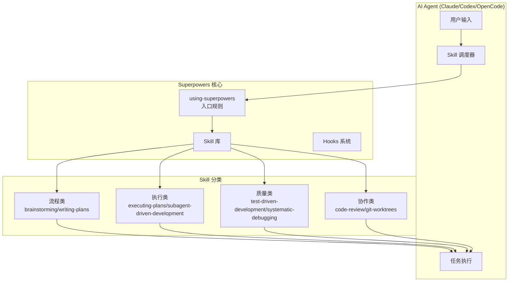
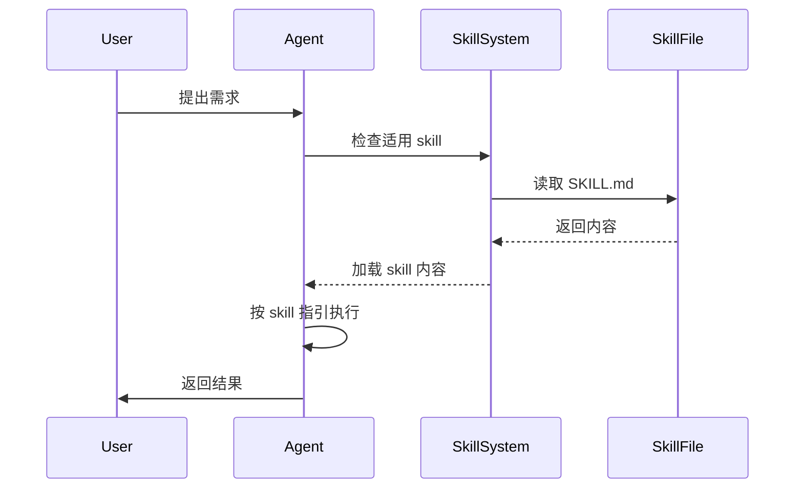
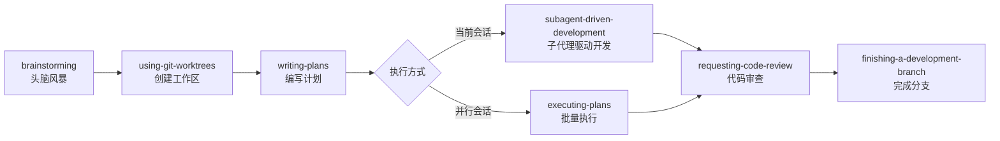
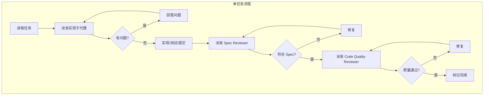
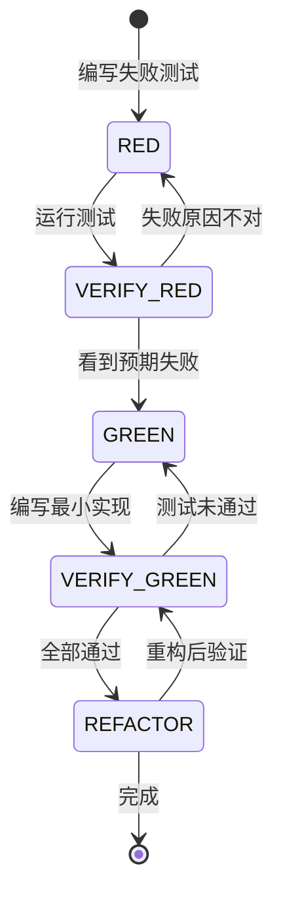
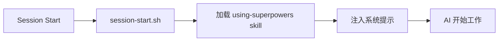

# Superpowers 源码分析报告

## 项目概述

**Superpowers** 是一个为 AI 编程助手（Claude Code、Codex、OpenCode）设计的**软件开发工作流框架**。它通过一套可组合的 "skills"（技能）系统，强制规范 AI 在编码过程中的行为模式，确保代码质量和工作效率。

项目核心理念：**不是让 AI 直接写代码，而是通过结构化流程引导 AI 正确地工作**。

---

## 架构设计

### 整体架构



### 核心设计思想

1. **强制前置检查**：任何任务开始前必须先检查是否有适用的 skill
2. **技能即代码**：Skill 是可版本控制、可测试的 Markdown 文档
3. **子代理驱动**：复杂任务通过派生子代理并行处理
4. **TDD 强制执行**：所有代码必须先写测试

---

## 核心模块分析

### 1. Skill 系统（核心）

#### 1.1 Skill 文件结构

每个 skill 是一个独立的目录，包含：

```
skills/{skill-name}/
  ├── SKILL.md              # 主文档（必须）
  ├── *.md                  # 辅助文档（可选）
  ├── *.ts/js/py            # 代码示例（可选）
  └── scripts/              # 可执行工具（可选）
```

#### 1.2 SKILL.md 格式规范

```yaml
---
name: skill-name
description: Use when [触发条件] - [不包含流程描述]
---

# Skill 标题

## Overview
核心原则：一句话概括

## When to Use
- 适用场景
- 不适用场景

## Core Pattern
Before/After 对比示例

## Quick Reference
快速参考表格

## Implementation
实现细节或链接到代码

## Common Mistakes
常见错误和解决方案
```

**关键设计**：description 只描述触发条件，**绝不描述流程**。这是为了防止 AI 只看 description 而不读完整 skill。

#### 1.3 Skill 加载机制



### 2. 核心工作流程

Superpowers 定义了完整的软件开发工作流：



#### 2.1 Brainstorming（头脑风暴）

**触发时机**：任何创造性工作之前

**核心流程**：
1. 检查项目当前状态
2. 一次只问一个问题
3. 提供 2-3 个方案选项
4. 分段展示设计（每段 200-300 字）
5. 保存设计文档到 `docs/plans/YYYY-MM-DD-<topic>-design.md`

**设计原则**：
- YAGNI（你不会需要它）-  ruthlessly 移除不必要的功能
- 增量验证 - 每段设计都需确认

#### 2.2 Writing Plans（编写计划）

**核心思想**：为"零上下文且品味欠佳的工程师"编写详细计划

**任务粒度**：每个任务 2-5 分钟完成

**计划模板**：
```markdown
# [功能名] 实现计划

> **For Claude:** REQUIRED SUB-SKILL: Use superpowers:executing-plans

**Goal:** 一句话描述目标
**Architecture:** 2-3 句架构说明
**Tech Stack:** 关键技术栈

---

### Task N: [组件名]

**Files:**
- Create: `exact/path/to/file.py`
- Modify: `exact/path/to/existing.py:123-145`
- Test: `tests/exact/path/to/test.py`

**Step 1: Write the failing test**
[完整测试代码]

**Step 2: Run test to verify it fails**
Run: `pytest tests/path/test.py::test_name -v`
Expected: FAIL with "function not defined"

**Step 3: Write minimal implementation**
[完整实现代码]

**Step 4: Run test to verify it passes**
...

**Step 5: Commit**
```

#### 2.3 Subagent-Driven Development（子代理驱动开发）

**核心创新**：每个任务派一个全新的子代理，避免上下文污染



**两阶段审查**：
1. **Spec Compliance Review**：检查是否符合计划要求
2. **Code Quality Review**：检查代码质量

**优势**：
- 每个子代理有新鲜上下文
- 并行安全（子代理互不干扰）
- 自动审查检查点
- 问题在早期被发现（修复成本低）

#### 2.4 Test-Driven Development（测试驱动开发）

**铁律**：`NO PRODUCTION CODE WITHOUT A FAILING TEST FIRST`

**Red-Green-Refactor 循环**：



**对抗理性化的设计**：

Skill 中专门有一个表格列出常见的"借口"和对应的"现实"：

| 借口 | 现实 |
|------|------|
| "太简单了不需要测试" | 简单代码也会坏。测试只需 30 秒。 |
| "我先写代码再补测试" | 后补的测试立即通过，证明不了什么。 |
| "我已经手动测试过了" | 手动测试 ≠ 系统化。无记录，不可重复。 |
| "删除 X 小时的工作是浪费" | 沉没成本谬误。保留未验证代码才是技术债。 |

#### 2.5 Systematic Debugging（系统化调试）

**四阶段流程**：

1. **Phase 1: Root Cause Investigation**
   - 仔细阅读错误信息
   - 稳定复现问题
   - 检查近期变更
   - 多组件系统添加诊断日志
   - 追踪数据流

2. **Phase 2: Pattern Analysis**
   - 找到工作正常的类似代码
   - 对比参考实现
   - 识别差异

3. **Phase 3: Hypothesis and Testing**
   - 形成单一假设
   - 最小化测试
   - 验证后再继续

4. **Phase 4: Implementation**
   - 创建失败测试用例
   - 单次修复
   - 验证修复
   - **如果 3+ 次修复失败：质疑架构**

### 3. 技术实现细节

#### 3.1 核心工具库（lib/skills-core.js）

```javascript
// 主要功能：
- extractFrontmatter()     // 提取 YAML frontmatter
- findSkillsInDir()        // 递归查找 skill
- resolveSkillPath()       // 解析 skill 路径（支持个人 skill 覆盖）
- checkForUpdates()        // 检查 git 更新
- stripFrontmatter()       // 去除 frontmatter 获取内容
```

#### 3.2 多平台支持

| 平台 | 配置路径 | 加载方式 |
|------|----------|----------|
| Claude Code | `.claude-plugin/` | Plugin 系统 + hooks |
| Codex | `.codex/` | 手动安装 + bootstrap |
| OpenCode | `.opencode/` | Native skill 工具 |

#### 3.3 Hook 系统



### 4. Skill 创建方法论

**Writing-Skills Skill 的核心洞察**：

> **Creating skills IS Test-Driven Development applied to process documentation.**

**TDD 映射到 Skill 创建**：

| TDD 概念 | Skill 创建 |
|----------|-----------|
| Test case | 压力场景 + 子代理 |
| Production code | Skill 文档 (SKILL.md) |
| Test fails (RED) | 代理违反规则（基线） |
| Test passes (GREEN) | 代理遵守 skill |
| Refactor | 关闭漏洞 |

**测试 Skill 的方法**：
1. 创建压力场景（时间压力、沉没成本、权威压力、疲劳）
2. 不带 skill 运行，记录基线行为
3. 编写针对具体违规的 skill
4. 带 skill 运行，验证遵守
5. 重复直到无漏洞

---

## 设计亮点

### 1. 对抗 AI 的"理性化"倾向

AI 和人类一样，会在压力下找借口跳过流程。Superpowers 通过以下方式对抗：

- **显式禁止**：列出所有常见的借口和对应反驳
- **红旗列表**：明确标注"如果你这么想，STOP"
- **无例外规则**："No exceptions" 反复强调
- **精神即文字**："Violating the letter is violating the spirit"

### 2. Claude Search Optimization (CSO)

为了让未来的 Claude 能找到正确的 skill：

- **Rich Description**：只包含触发条件，不包含流程（防止 AI 只看摘要）
- **关键词覆盖**：错误消息、症状、工具名
- **Token 效率**：入门 skill <150 词，常用 skill <200 词
- **交叉引用**：使用 skill 名而非 `@` 链接（避免强制加载）

### 3. 子代理架构

**上下文污染问题**：
- 一个长会话中，AI 会积累大量上下文
- 早期信息可能污染后期判断
- 任务之间的依赖关系可能混乱

**解决方案**：
- 每个任务使用全新子代理
- 主代理负责编排和上下文管理
- 审查也是独立子代理（无偏见）

### 4. 技能影子机制

支持个人 skill 覆盖官方 skill：

```javascript
// 解析顺序：
1. 个人 skill (~/.claude/skills/)
2. 官方 skill (vendors/superpowers/skills/)
3. 显式前缀 superpowers: 强制使用官方
```

---

## 使用场景

### 适用场景

- **大型功能开发**：需要多步骤、多文件修改
- **团队协作**：需要代码审查规范
- **质量要求高**：需要 TDD 和系统调试
- **长期维护**：需要可重复的流程

### 不适用场景

- **一次性脚本**：设置成本过高
- **探索性编程**：流程过于严格
- **紧急热修复**：需要时间投入

---

## 优缺点分析

### 优点

1. **质量保证**：TDD + 两阶段审查确保代码质量
2. **流程标准化**：消除个人风格差异
3. **可扩展性**：Skill 系统易于扩展
4. **多平台**：支持 Claude Code、Codex、OpenCode
5. **经过验证**：大量实际使用案例

### 缺点

1. **学习曲线**：需要理解 Skill 系统和工作流
2. **设置成本**：初始配置和插件安装
3. **灵活性降低**：严格流程可能不适合所有场景
4. **Token 消耗**：子代理驱动模式消耗更多 API 调用
5. **过度设计**：简单任务可能感觉繁琐

---

## 总结

Superpowers 是一个**面向 AI 的软件开发流程框架**，它通过 Skill 系统将最佳实践（TDD、系统调试、代码审查）编码为可执行的指令。

**核心价值**：
- 不让 AI "自由发挥"，而是引导 AI "正确地工作"
- 通过结构化流程保证代码质量
- 子代理架构解决上下文污染问题

**适合人群**：
- 使用 Claude Code/Codex/OpenCode 进行严肃开发
- 重视代码质量和可维护性
- 愿意投入时间建立规范流程

---

## 参考链接

- 官方仓库：https://github.com/obra/superpowers
- 博客文章：https://blog.fsck.com/2025/10/09/superpowers/
- Claude Code 插件市场：`obra/superpowers-marketplace`
